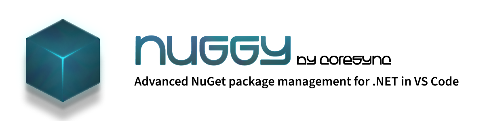

<div align="center">

**The intelligent NuGet package manager for Visual Studio Code**

_Built for modern .NET developers navigating complex, multi-format solutions_

[](https://github.com/coresync/nuggy)
[](LICENSE)
[](https://dotnet.microsoft.com/)

</div>

---

## 🎯 Why Nuggy?

Managing NuGet packages across large .NET solutions is **painful**. You're dealing with:

- 📦 **Central Package Management (CPM)** - Some projects use it, others don't
- 🏗️ **MSBuild inheritance** - TFMs and versions scattered across `Directory.Build.props`
- 🤷 **Invisible dependencies** - No clear view of what's using what
- 🔀 **Mixed project formats** - Legacy .NET Framework alongside modern .NET 8+
- 🔄 **Migration chaos** - Transitioning from `packages.config` to `PackageReference`

**Standard tools fail** because they don't understand the **deep structure** of your solution.

**Nuggy changes that.** It's a context-aware diagnostic engine that understands your entire solution architecture, whether you're running a pure modern setup, legacy .NET Framework, or a hybrid in transition.

---

## ✨ Key Features

### 🔍 **Intelligent Solution Analysis**

- **Multi-format support**: Analyzes both classic `.sln` and modern **`.slnx`** solution formats
- **Project type detection**: Automatically identifies SDK-style vs. Legacy .NET Framework projects
- **Hybrid solution intelligence**: Detects transitional architectures mixing old and new

### 📦 **Central Package Management (CPM)**

- **Automatic CPM detection**: Finds and parses `Directory.Packages.props` files
- **Hierarchical CPM support**: Handles multiple CPM files across solution directories
- **Version conflict detection**: Identifies projects with local versions when CPM is enabled
- **Affected project mapping**: Shows which projects are governed by each CPM file

### 🏗️ **MSBuild Property Resolution**

- **Smart TFM detection**: Resolves Target Framework Monikers from `.csproj`, `Directory.Build.props`, and `Directory.Build.targets`
- **Property inheritance**: Follows MSBuild's priority chain to find effective values
- **Variable resolution**: Resolves MSBuild property references like `$(MySharedFramework)` → `net8.0`

### 🔄 **Legacy & Transitional Support**

- **`packages.config`**: Full support for legacy NuGet package format
- **Mixed-mode detection**: Identifies solutions combining `packages.config` and `PackageReference`
- **Transitional diagnostics**: Provides insights for teams migrating from .NET Framework to .NET Core/8+

### 🛠️ **Diagnostic Modes**

Nuggy analyzes your solution and categorizes it into one of three management modes:

| Mode           | Description                                                                  | Example                                               |
| -------------- | ---------------------------------------------------------------------------- | ----------------------------------------------------- |
| **🔵 Local**   | Each project manages its own package versions independently                  | Modern solution without CPM                           |
| **🟢 Central** | All projects use Central Package Management (`Directory.Packages.props`)     | Enterprise solution with CPM enabled                  |
| **🟠 Mixed**   | Combination of Legacy projects (packages.config) + Modern SDK-style projects | Transitional solution during .NET Framework migration |

### 🎨 **NuGet.Config Resolution**

- **Hierarchical config detection**: Finds all `NuGet.Config` files from project to solution root
- **Source mapping**: Parses package sources and their configurations
- **Package source mapping**: Supports pattern-based source routing (e.g., `Microsoft.*` → NuGet.org)
- **Scope detection**: Identifies global vs. solution-scoped configurations

---

## 🚀 Getting Started

### Installation

1. Open Visual Studio Code
2. Go to Extensions (`Ctrl+Shift+X`)
3. Search for "Nuggy"
4. Click **Install**

### Quick Start

1. **Open your .NET solution** in VS Code
2. **Open Command Palette** (`Ctrl+Shift+P`)
3. Type: `Nuggy: Open Nuggy Panel`

Nuggy will automatically:

- ✅ Detect your solution format (`.sln` / `.slnx`)
- ✅ Identify all projects (SDK-style / Legacy)
- ✅ Analyze package management mode (Local / Central / Mixed)
- ✅ Resolve Target Framework Monikers (TFMs)
- ✅ Find NuGet configuration files
- ✅ Detect version conflicts and issues

---

## 📊 What Nuggy Analyzes

### Solution-Level Analysis

```
✓ Solution format (.sln / .slnx)
✓ Project count and types (SDK-style / Legacy)
✓ Management mode (Local / Central / Mixed)
✓ Transitional state detection
✓ NuGet.Config hierarchy
```

### Project-Level Analysis

```
✓ Project SDK type (SDK-Style / Legacy / Unknown)
✓ Target Framework Moniker (TFM) - with MSBuild property resolution
✓ Package references (PackageReference / packages.config)
✓ Local vs. central version detection
✓ Multi-targeting support
```

### Package-Level Analysis

```
✓ Central package versions (Directory.Packages.props)
✓ Local package references (per project)
✓ Legacy packages (packages.config)
✓ Version conflicts (local override when CPM enabled)
✓ Affected projects per package
```

---

## 🛣️ Roadmap

### ✅ Completed (Current Version)

- [x] **EPIC 1**: Semantic Diagnostic Engine & Solution Scanning
  - [x] Workspace mapping (`SLN` / `SLNX` / `Solution folders`)
  - [x] Detection of global configuration files (`Props` / `Targets`)
  - [x] Diagnosis of package management mode (`CPM` vs. `Local`)
  - [x] Calculation of Effective TFM and MSBuild property resolution
  - [x] Analysis of legacy files (`packages.config`) and mixed solutions
  - [x] NuGet configuration resolution (`NuGet.Config`)

### 🚧 In Progress

- [ ] **EPIC 2**: Decision Engine and Compatibility Analysis

### 📋 Planned

- [ ] **EPIC 3**: Enhanced CPM & Solution Consistency

- [ ] **EPIC 4**: Advanced Configuration & Runtime Engines

- [ ] **EPIC 5**: Interactive Search and Predictive Installation

- [ ] **EPIC 6**: Maintenance, Diagnostics, and Observability

- [ ] **EPIC 7**: User Interface (UI/UX)

---

## 🤝 Contributing

Contributions are welcome! Please feel free to submit issues and pull requests.

## 📝 License

This project is licensed under the MIT License - see the [LICENSE](LICENSE) file for details.

---

## 💬 Support

- 📧 **Email**: support@coresync.dev
- 🐛 **Issues**: [GitHub Issues](https://github.com/coresync/nuggy/issues)
- 💡 **Feature Requests**: [GitHub Discussions](https://github.com/coresync/nuggy/discussions)

---

<div align="center">

**Made with ❤️ by [Coresync](https://github.com/coresync)**

_Simplifying NuGet management for .NET developers worldwide_

</div>
